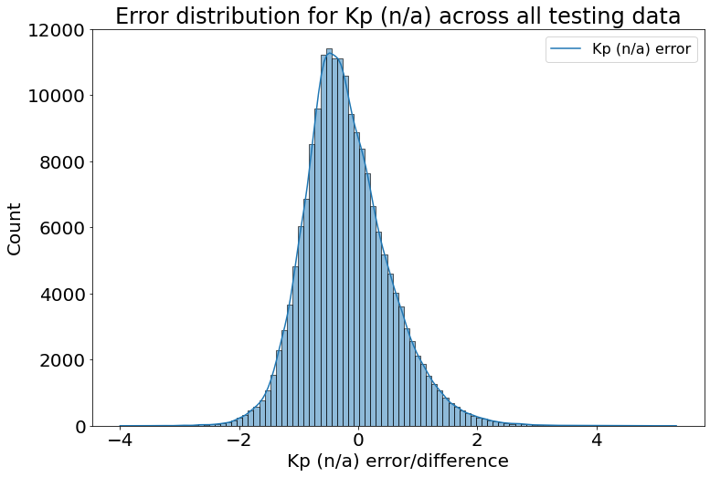
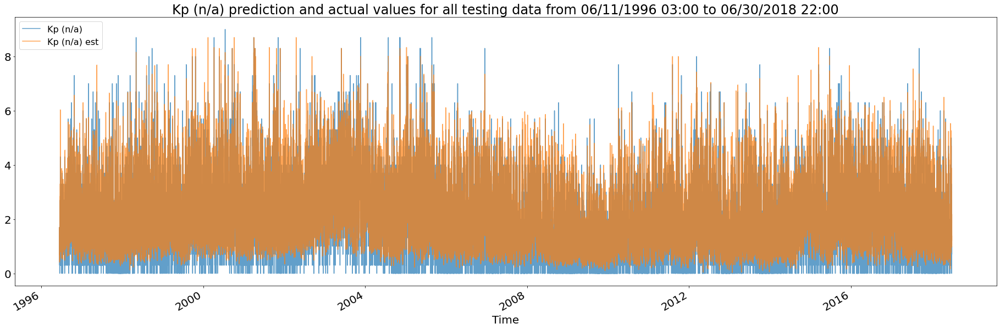
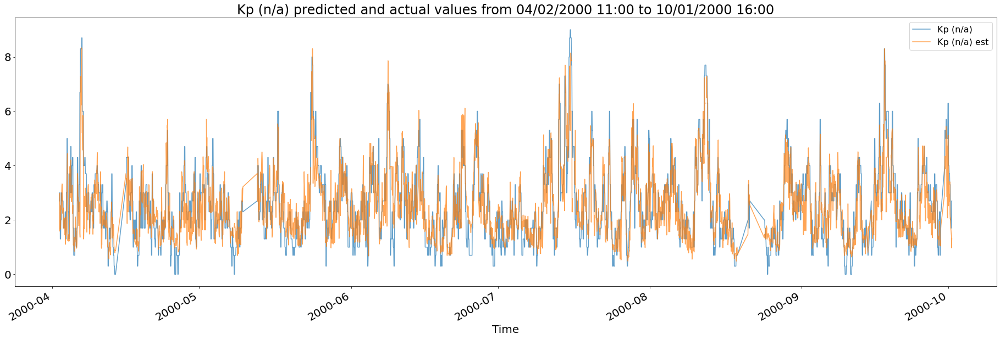
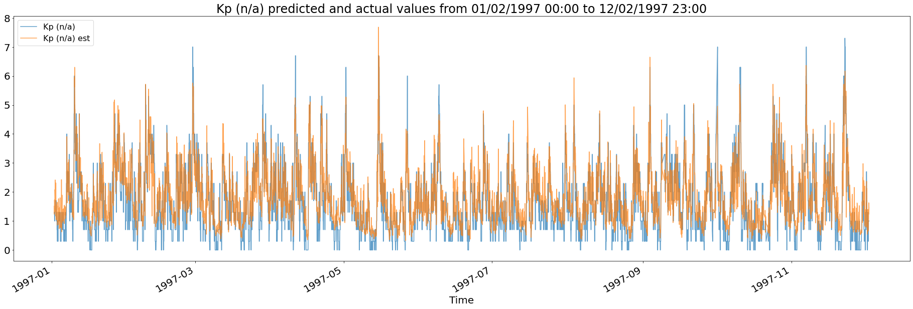
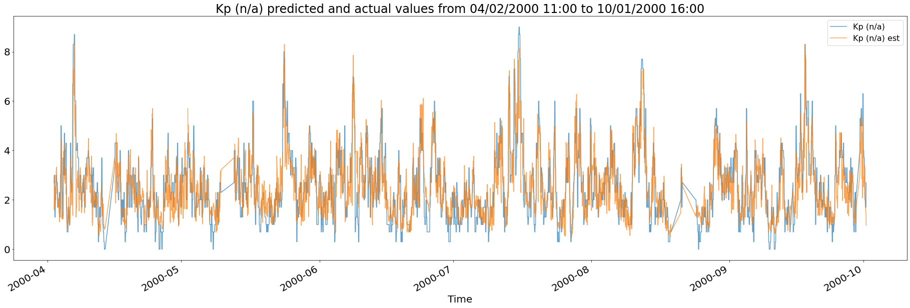
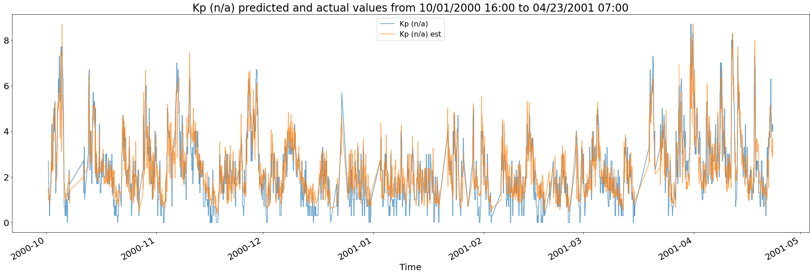
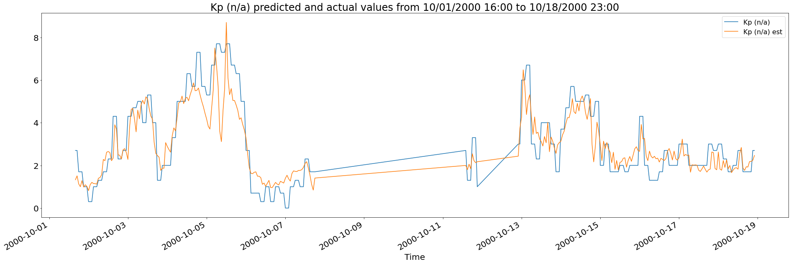

# Modeler Notebook Analysis of Magnetospheric State Query System (MSQS) data
Relies on importing mlr_code.py instead of the analysis_notebook standalone  
Any changes to the code in mlr_code.py are reflected in this file AFTER RESTARTING KERNEL  
tester.ipynb, mlr_code.py, and extra_funcs.py MUST ALL BE IN THE SAME DIRECTORY


```python
from mlr_code import import_data, MLR # Import local mlr_code file and functions from file

import pandas as pd # For store and organize data as pandas databases
from sklearn.metrics import mean_squared_error
import matplotlib.pyplot as plt # For plotting data
import seaborn as sns # Alternative way of plotting data
from datetime import datetime, time # For converting individual dates, times, and hours to an easily (pandas/matplotlib) readable datetime format

pd.options.mode.chained_assignment = None # Default to "warn"; To disable the warning caused by chained index calls on pandas series/databases
```

### Configurable model options
MATCH - Response variable to determine coefficients for (between Kp, AE, and Dst)  
CHANGE_MODEL_SIZE_THRESHOLD - For the sample size above the threshold, the machine learning linear regression estimation is used, otherwise, the arithmetic mean estimation is used  
time_shifts - The corresponding time shifts for each input parameter given the response parameter  
training_data_interval, testing_data_interval - The time intervals to run as training and testing data


```python
MATCH = 'Kp (n/a)' # from 'Kp (n/a)','AE (hourly) (nT)', or 'Dst (nT)'
CHANGE_MODEL_SIZE_THRESHOLD = 80
time_shifts = {
    'Kp (n/a)': { # For response parameter Kp
        'SW Flow Pressure (nPa)': 0, # Default 0 hours
        'SW Bmag (nT)': 0, # 0 hours
        'SW Bz (nT)': 1, # 1 hour
        'SW Velocity (km/sec)': 0, # 0 hours
        'Kp (n/a)': 0, # 0 hours
        'AE (hourly) (nT)': 0 # 0 hours
    },
    'AE (hourly) (nT)': { # For response parameter AE
        'SW Flow Pressure (nPa)': 0, # Default 0 hours
        'SW Bmag (nT)': 0, # 0 hours
        'SW Bz (nT)': 1, # 1 hour
        'SW Velocity (km/sec)': 0, # 0 hours
        'Kp (n/a)': 0, # 0 hours
        'AE (hourly) (nT)': 0 # 0 hours
    },
    'Dst (nT)': { # For response parameter Dst
        'SW Flow Pressure (nPa)': 2, # Default 2 hours
        'SW Bmag (nT)': 2, # 2 hours
        'SW Bz (nT)': 3, # 3 hours
        'SW Velocity (km/sec)': 2, # 2 hours
        'Kp (n/a)': 2, # 2 hours
        'AE (hourly) (nT)': 2 # 2 hours
    }
}
training_data_interval = (datetime(1970, 1, 1, 1, 0),datetime(1996, 6, 11, 3, 0)) # Configurable datetime(year, month, day, hour, min)
testing_data_interval = (datetime(1996, 6, 11, 3, 0),datetime(2018, 6, 30, 23, 0)) # Configurable datetime(year, month, day, hour, min)
```

### Import data from CSV
Extract data from local csv file (must be in same directory as this file)  
Time shifts the data appropriately given a time shift dictionary and the match variable to determine which time shifts to use


```python
data = import_data('omni2_h8ZIWOAzck.csv', MATCH, time_shifts) # file_name, match variable, time_shift dictionary
```

### Split training and testing data
Splits data into train and test according to the time intervals specified by the model configuration above  
The time interval is currently set to inclusive beginning time and exclusive ending time, but this may be changed  
These intervals can overlap


```python
# Split data within the training and testing time intervals specified
# Inclusive beginning time to exclusive ending time (modifiable)
training_data = data[(data['datetime'] >= training_data_interval[0]) & (data['datetime'] < training_data_interval[1])]
testing_data = data[(data['datetime'] >= testing_data_interval[0]) & (data['datetime'] < testing_data_interval[1])]
```

### Machine learning model
Use the multiple linear regression model by sklearn to extract prediction data for both training and testing and also the learned linear coefficient data


```python
# Run multiple linear regression model and extract coefficients dataframe, resulting training dataframe with predictions, and resulting testing dataframe with predictions
coeff_df, training_data, testing_data = MLR(training_data, testing_data, MATCH, CHANGE_MODEL_SIZE_THRESHOLD)
```

## Results
### Training data and testing data dataframes


```python
training_data
```


<div>
<style scoped>
    .dataframe tbody tr th:only-of-type {
        vertical-align: middle;
    }

    .dataframe tbody tr th {
        vertical-align: top;
    }

    .dataframe thead th {
        text-align: right;
    }
</style>
<table border="1" class="dataframe">
  <thead>
    <tr style="text-align: right;">
      <th></th>
      <th>Year</th>
      <th>Decimal Day</th>
      <th>hour:min</th>
      <th>SW Flow Pressure (nPa)</th>
      <th>SW Bmag (nT)</th>
      <th>SW Bz (nT)</th>
      <th>SW Velocity (km/sec)</th>
      <th>Kp (n/a)</th>
      <th>AE (hourly) (nT)</th>
      <th>Dst (nT)</th>
      <th>datetime</th>
      <th>Kp (n/a) est</th>
      <th>Kp (n/a) diff</th>
    </tr>
  </thead>
  <tbody>
    <tr>
      <th>1</th>
      <td>1970</td>
      <td>1</td>
      <td>1</td>
      <td>1.12</td>
      <td>3.3</td>
      <td>-0.2</td>
      <td>332</td>
      <td>0.7</td>
      <td>26</td>
      <td>5</td>
      <td>1970-01-01 01:00:00</td>
      <td>0.744473</td>
      <td>-0.044473</td>
    </tr>
    <tr>
      <th>2</th>
      <td>1970</td>
      <td>1</td>
      <td>2</td>
      <td>1.12</td>
      <td>2.5</td>
      <td>1.9</td>
      <td>332</td>
      <td>0.7</td>
      <td>34</td>
      <td>8</td>
      <td>1970-01-01 02:00:00</td>
      <td>0.610866</td>
      <td>0.089134</td>
    </tr>
    <tr>
      <th>3</th>
      <td>1970</td>
      <td>1</td>
      <td>3</td>
      <td>1.17</td>
      <td>4.5</td>
      <td>1.6</td>
      <td>321</td>
      <td>2.0</td>
      <td>37</td>
      <td>9</td>
      <td>1970-01-01 03:00:00</td>
      <td>0.649116</td>
      <td>1.350884</td>
    </tr>
    <tr>
      <th>4</th>
      <td>1970</td>
      <td>1</td>
      <td>4</td>
      <td>1.17</td>
      <td>4.5</td>
      <td>-1.2</td>
      <td>321</td>
      <td>2.0</td>
      <td>78</td>
      <td>8</td>
      <td>1970-01-01 04:00:00</td>
      <td>1.114645</td>
      <td>0.885355</td>
    </tr>
    <tr>
      <th>5</th>
      <td>1970</td>
      <td>1</td>
      <td>5</td>
      <td>1.17</td>
      <td>6.3</td>
      <td>-3.4</td>
      <td>321</td>
      <td>2.0</td>
      <td>137</td>
      <td>4</td>
      <td>1970-01-01 05:00:00</td>
      <td>1.970318</td>
      <td>0.029682</td>
    </tr>
    <tr>
      <th>...</th>
      <td>...</td>
      <td>...</td>
      <td>...</td>
      <td>...</td>
      <td>...</td>
      <td>...</td>
      <td>...</td>
      <td>...</td>
      <td>...</td>
      <td>...</td>
      <td>...</td>
      <td>...</td>
      <td>...</td>
    </tr>
    <tr>
      <th>231790</th>
      <td>1996</td>
      <td>162</td>
      <td>22</td>
      <td>1.63</td>
      <td>3.9</td>
      <td>-0.4</td>
      <td>350</td>
      <td>0.7</td>
      <td>45</td>
      <td>-5</td>
      <td>1996-06-10 22:00:00</td>
      <td>1.154602</td>
      <td>-0.454602</td>
    </tr>
    <tr>
      <th>231791</th>
      <td>1996</td>
      <td>162</td>
      <td>23</td>
      <td>1.58</td>
      <td>3.8</td>
      <td>1.6</td>
      <td>344</td>
      <td>0.7</td>
      <td>49</td>
      <td>-1</td>
      <td>1996-06-10 23:00:00</td>
      <td>0.80062</td>
      <td>-0.10062</td>
    </tr>
    <tr>
      <th>231792</th>
      <td>1996</td>
      <td>163</td>
      <td>0</td>
      <td>1.5</td>
      <td>3.3</td>
      <td>2.5</td>
      <td>343</td>
      <td>0.3</td>
      <td>47</td>
      <td>4</td>
      <td>1996-06-11 00:00:00</td>
      <td>0.639203</td>
      <td>-0.339203</td>
    </tr>
    <tr>
      <th>231793</th>
      <td>1996</td>
      <td>163</td>
      <td>1</td>
      <td>1.43</td>
      <td>3.7</td>
      <td>2.5</td>
      <td>340</td>
      <td>0.3</td>
      <td>39</td>
      <td>6</td>
      <td>1996-06-11 01:00:00</td>
      <td>0.657663</td>
      <td>-0.357663</td>
    </tr>
    <tr>
      <th>231794</th>
      <td>1996</td>
      <td>163</td>
      <td>2</td>
      <td>1.47</td>
      <td>3.2</td>
      <td>1.6</td>
      <td>340</td>
      <td>0.3</td>
      <td>40</td>
      <td>5</td>
      <td>1996-06-11 02:00:00</td>
      <td>0.664049</td>
      <td>-0.364049</td>
    </tr>
  </tbody>
</table>
<p>100000 rows × 13 columns</p>
</div>


```python
testing_data
```


<div>
<style scoped>
    .dataframe tbody tr th:only-of-type {
        vertical-align: middle;
    }

    .dataframe tbody tr th {
        vertical-align: top;
    }

    .dataframe thead th {
        text-align: right;
    }
</style>
<table border="1" class="dataframe">
  <thead>
    <tr style="text-align: right;">
      <th></th>
      <th>Year</th>
      <th>Decimal Day</th>
      <th>hour:min</th>
      <th>SW Flow Pressure (nPa)</th>
      <th>SW Bmag (nT)</th>
      <th>SW Bz (nT)</th>
      <th>SW Velocity (km/sec)</th>
      <th>Kp (n/a)</th>
      <th>AE (hourly) (nT)</th>
      <th>Dst (nT)</th>
      <th>datetime</th>
      <th>Kp (n/a) est</th>
      <th>Kp (n/a) diff</th>
    </tr>
  </thead>
  <tbody>
    <tr>
      <th>231795</th>
      <td>1996</td>
      <td>163</td>
      <td>3</td>
      <td>1.52</td>
      <td>3.4</td>
      <td>0.3</td>
      <td>338</td>
      <td>1.0</td>
      <td>64</td>
      <td>3</td>
      <td>1996-06-11 03:00:00</td>
      <td>0.786704</td>
      <td>0.213296</td>
    </tr>
    <tr>
      <th>231796</th>
      <td>1996</td>
      <td>163</td>
      <td>4</td>
      <td>1.58</td>
      <td>2.8</td>
      <td>-0.1</td>
      <td>339</td>
      <td>1.0</td>
      <td>58</td>
      <td>6</td>
      <td>1996-06-11 04:00:00</td>
      <td>0.769511</td>
      <td>0.230489</td>
    </tr>
    <tr>
      <th>231797</th>
      <td>1996</td>
      <td>163</td>
      <td>5</td>
      <td>1.99</td>
      <td>4.0</td>
      <td>-0.4</td>
      <td>341</td>
      <td>1.0</td>
      <td>57</td>
      <td>7</td>
      <td>1996-06-11 05:00:00</td>
      <td>1.185704</td>
      <td>-0.185704</td>
    </tr>
    <tr>
      <th>231798</th>
      <td>1996</td>
      <td>163</td>
      <td>6</td>
      <td>2.53</td>
      <td>3.7</td>
      <td>1.1</td>
      <td>344</td>
      <td>1.0</td>
      <td>67</td>
      <td>11</td>
      <td>1996-06-11 06:00:00</td>
      <td>1.138514</td>
      <td>-0.138514</td>
    </tr>
    <tr>
      <th>231799</th>
      <td>1996</td>
      <td>163</td>
      <td>7</td>
      <td>2.84</td>
      <td>3.2</td>
      <td>1.5</td>
      <td>352</td>
      <td>1.0</td>
      <td>144</td>
      <td>13</td>
      <td>1996-06-11 07:00:00</td>
      <td>1.197282</td>
      <td>-0.197282</td>
    </tr>
    <tr>
      <th>...</th>
      <td>...</td>
      <td>...</td>
      <td>...</td>
      <td>...</td>
      <td>...</td>
      <td>...</td>
      <td>...</td>
      <td>...</td>
      <td>...</td>
      <td>...</td>
      <td>...</td>
      <td>...</td>
      <td>...</td>
    </tr>
    <tr>
      <th>425106</th>
      <td>2018</td>
      <td>181</td>
      <td>18</td>
      <td>1.05</td>
      <td>3.8</td>
      <td>1.9</td>
      <td>436</td>
      <td>0.7</td>
      <td>44</td>
      <td>-5</td>
      <td>2018-06-30 18:00:00</td>
      <td>1.103126</td>
      <td>-0.403126</td>
    </tr>
    <tr>
      <th>425107</th>
      <td>2018</td>
      <td>181</td>
      <td>19</td>
      <td>1.2</td>
      <td>3.3</td>
      <td>2.5</td>
      <td>460</td>
      <td>0.7</td>
      <td>44</td>
      <td>-6</td>
      <td>2018-06-30 19:00:00</td>
      <td>1.18383</td>
      <td>-0.48383</td>
    </tr>
    <tr>
      <th>425108</th>
      <td>2018</td>
      <td>181</td>
      <td>20</td>
      <td>1.08</td>
      <td>3.4</td>
      <td>-1.9</td>
      <td>454</td>
      <td>0.7</td>
      <td>62</td>
      <td>-7</td>
      <td>2018-06-30 20:00:00</td>
      <td>2.18545</td>
      <td>-1.48545</td>
    </tr>
    <tr>
      <th>425109</th>
      <td>2018</td>
      <td>181</td>
      <td>21</td>
      <td>0.93</td>
      <td>3.7</td>
      <td>0.2</td>
      <td>451</td>
      <td>1.0</td>
      <td>114</td>
      <td>-10</td>
      <td>2018-06-30 21:00:00</td>
      <td>1.275243</td>
      <td>-0.275243</td>
    </tr>
    <tr>
      <th>425110</th>
      <td>2018</td>
      <td>181</td>
      <td>22</td>
      <td>0.85</td>
      <td>3.7</td>
      <td>-0.2</td>
      <td>431</td>
      <td>1.0</td>
      <td>103</td>
      <td>-9</td>
      <td>2018-06-30 22:00:00</td>
      <td>1.376683</td>
      <td>-0.376683</td>
    </tr>
  </tbody>
</table>
<p>188248 rows × 13 columns</p>
</div>


### Linear coefficients dataframe
The columns with the input parameters represent the bin indices for a coefficient set  
The arithmetic mean of the output parameters for the data in that bin combination as well as the number of entries fitting with that bin combination are included


```python
# Dataframe storing the coefficients for each bin combination (a bin interval of -1 is (-inf,inf))
coeff_df
```


<div>
<style scoped>
    .dataframe tbody tr th:only-of-type {
        vertical-align: middle;
    }

    .dataframe tbody tr th {
        vertical-align: top;
    }

    .dataframe thead th {
        text-align: right;
    }
</style>
<table border="1" class="dataframe">
  <thead>
    <tr style="text-align: right;">
      <th></th>
      <th>SW Flow Pressure (nPa)</th>
      <th>SW Bmag (nT)</th>
      <th>SW Bz (nT)</th>
      <th>SW Velocity (km/sec)</th>
      <th>Kp (n/a)</th>
      <th>AE (hourly) (nT)</th>
      <th>Dst (nT)</th>
      <th>SW Flow Pressure (nPa) coeff</th>
      <th>SW Bmag (nT) coeff</th>
      <th>SW Bz (nT) coeff</th>
      <th>SW Velocity (km/sec) coeff</th>
      <th>intercept</th>
      <th>arithmetic_mean</th>
      <th>model_size</th>
    </tr>
  </thead>
  <tbody>
    <tr>
      <th>0</th>
      <td>0</td>
      <td>0</td>
      <td>2</td>
      <td>0</td>
      <td>-1</td>
      <td>-1</td>
      <td>-1</td>
      <td>-17.125537</td>
      <td>0.206374</td>
      <td>0.007875</td>
      <td>0.027988</td>
      <td>-0.147204</td>
      <td>0.725</td>
      <td>8</td>
    </tr>
    <tr>
      <th>1</th>
      <td>0</td>
      <td>0</td>
      <td>2</td>
      <td>1</td>
      <td>-1</td>
      <td>-1</td>
      <td>-1</td>
      <td>-2.532522</td>
      <td>0.52729</td>
      <td>-0.276734</td>
      <td>-0.004109</td>
      <td>1.628952</td>
      <td>0.555556</td>
      <td>27</td>
    </tr>
    <tr>
      <th>2</th>
      <td>0</td>
      <td>0</td>
      <td>2</td>
      <td>2</td>
      <td>-1</td>
      <td>-1</td>
      <td>-1</td>
      <td>1.591501</td>
      <td>0.329289</td>
      <td>-1.501563</td>
      <td>0.011489</td>
      <td>-5.971972</td>
      <td>0.941667</td>
      <td>12</td>
    </tr>
    <tr>
      <th>3</th>
      <td>0</td>
      <td>0</td>
      <td>2</td>
      <td>3</td>
      <td>-1</td>
      <td>-1</td>
      <td>-1</td>
      <td>0.0</td>
      <td>0.0</td>
      <td>0.0</td>
      <td>0.0</td>
      <td>1.7</td>
      <td>1.7</td>
      <td>1</td>
    </tr>
    <tr>
      <th>4</th>
      <td>0</td>
      <td>0</td>
      <td>3</td>
      <td>0</td>
      <td>-1</td>
      <td>-1</td>
      <td>-1</td>
      <td>0.049616</td>
      <td>0.297914</td>
      <td>-0.06976</td>
      <td>-0.010496</td>
      <td>2.851688</td>
      <td>0.7375</td>
      <td>8</td>
    </tr>
    <tr>
      <th>...</th>
      <td>...</td>
      <td>...</td>
      <td>...</td>
      <td>...</td>
      <td>...</td>
      <td>...</td>
      <td>...</td>
      <td>...</td>
      <td>...</td>
      <td>...</td>
      <td>...</td>
      <td>...</td>
      <td>...</td>
      <td>...</td>
    </tr>
    <tr>
      <th>742</th>
      <td>6</td>
      <td>4</td>
      <td>5</td>
      <td>1</td>
      <td>-1</td>
      <td>-1</td>
      <td>-1</td>
      <td>0.000599</td>
      <td>-0.000705</td>
      <td>-0.010902</td>
      <td>-0.039774</td>
      <td>18.881896</td>
      <td>3.666667</td>
      <td>3</td>
    </tr>
    <tr>
      <th>743</th>
      <td>6</td>
      <td>4</td>
      <td>5</td>
      <td>2</td>
      <td>-1</td>
      <td>-1</td>
      <td>-1</td>
      <td>-0.078847</td>
      <td>0.305564</td>
      <td>0.002121</td>
      <td>0.040084</td>
      <td>-20.803915</td>
      <td>3.4</td>
      <td>4</td>
    </tr>
    <tr>
      <th>744</th>
      <td>6</td>
      <td>4</td>
      <td>5</td>
      <td>3</td>
      <td>-1</td>
      <td>-1</td>
      <td>-1</td>
      <td>-0.01785</td>
      <td>-0.015985</td>
      <td>0.001332</td>
      <td>0.062164</td>
      <td>-29.534807</td>
      <td>5.0</td>
      <td>2</td>
    </tr>
    <tr>
      <th>745</th>
      <td>6</td>
      <td>4</td>
      <td>5</td>
      <td>4</td>
      <td>-1</td>
      <td>-1</td>
      <td>-1</td>
      <td>-0.164259</td>
      <td>-0.011652</td>
      <td>0.059555</td>
      <td>0.003112</td>
      <td>7.978559</td>
      <td>6.94</td>
      <td>5</td>
    </tr>
    <tr>
      <th>746</th>
      <td>6</td>
      <td>4</td>
      <td>5</td>
      <td>5</td>
      <td>-1</td>
      <td>-1</td>
      <td>-1</td>
      <td>0.144226</td>
      <td>0.378824</td>
      <td>-0.649452</td>
      <td>-0.069738</td>
      <td>64.630123</td>
      <td>6.0</td>
      <td>5</td>
    </tr>
  </tbody>
</table>
<p>747 rows × 14 columns</p>
</div>


### Number of valid testing data estimates
Number of entries with a valid estimation for the response parameter vs number of entries with no data for that bin combination to make an estimate


```python
# (# entries with a valid estimation for the response parameter, # entries with no estimation)
testing_data[testing_data[MATCH + ' est'].notnull()].shape[0], testing_data[testing_data[MATCH + ' est'].isnull()].shape[0]
```


    (187888, 360)


### Testing data sorted by increasing estimation error


```python
# Sorted by increasing estimation error
testing_data[testing_data[MATCH + ' est'].notnull()].reindex(testing_data[testing_data[MATCH + ' est'].notnull()][MATCH + ' diff'].abs().sort_values().index)
```


<div>
<style scoped>
    .dataframe tbody tr th:only-of-type {
        vertical-align: middle;
    }

    .dataframe tbody tr th {
        vertical-align: top;
    }

    .dataframe thead th {
        text-align: right;
    }
</style>
<table border="1" class="dataframe">
  <thead>
    <tr style="text-align: right;">
      <th></th>
      <th>Year</th>
      <th>Decimal Day</th>
      <th>hour:min</th>
      <th>SW Flow Pressure (nPa)</th>
      <th>SW Bmag (nT)</th>
      <th>SW Bz (nT)</th>
      <th>SW Velocity (km/sec)</th>
      <th>Kp (n/a)</th>
      <th>AE (hourly) (nT)</th>
      <th>Dst (nT)</th>
      <th>datetime</th>
      <th>Kp (n/a) est</th>
      <th>Kp (n/a) diff</th>
    </tr>
  </thead>
  <tbody>
    <tr>
      <th>250821</th>
      <td>1998</td>
      <td>224</td>
      <td>21</td>
      <td>1.25</td>
      <td>0.9</td>
      <td>5.7</td>
      <td>418</td>
      <td>3.0</td>
      <td>68</td>
      <td>1</td>
      <td>1998-08-12 21:00:00</td>
      <td>3.0</td>
      <td>0.0</td>
    </tr>
    <tr>
      <th>366538</th>
      <td>2011</td>
      <td>298</td>
      <td>10</td>
      <td>0.83</td>
      <td>23.5</td>
      <td>8.6</td>
      <td>451</td>
      <td>3.0</td>
      <td>219</td>
      <td>-79</td>
      <td>2011-10-25 10:00:00</td>
      <td>3.0</td>
      <td>0.0</td>
    </tr>
    <tr>
      <th>402959</th>
      <td>2015</td>
      <td>354</td>
      <td>23</td>
      <td>0.64</td>
      <td>19.5</td>
      <td>-17.9</td>
      <td>422</td>
      <td>6.3</td>
      <td>479</td>
      <td>-161</td>
      <td>2015-12-20 23:00:00</td>
      <td>6.3</td>
      <td>0.0</td>
    </tr>
    <tr>
      <th>372883</th>
      <td>2012</td>
      <td>197</td>
      <td>19</td>
      <td>1.41</td>
      <td>21.4</td>
      <td>-16.2</td>
      <td>537</td>
      <td>7.0</td>
      <td>951</td>
      <td>-127</td>
      <td>2012-07-15 19:00:00</td>
      <td>7.0</td>
      <td>0.0</td>
    </tr>
    <tr>
      <th>304175</th>
      <td>2004</td>
      <td>256</td>
      <td>23</td>
      <td>0.16</td>
      <td>10.2</td>
      <td>2.4</td>
      <td>255</td>
      <td>0.3</td>
      <td>29</td>
      <td>3</td>
      <td>2004-09-12 23:00:00</td>
      <td>0.3</td>
      <td>0.0</td>
    </tr>
    <tr>
      <th>...</th>
      <td>...</td>
      <td>...</td>
      <td>...</td>
      <td>...</td>
      <td>...</td>
      <td>...</td>
      <td>...</td>
      <td>...</td>
      <td>...</td>
      <td>...</td>
      <td>...</td>
      <td>...</td>
      <td>...</td>
    </tr>
    <tr>
      <th>310043</th>
      <td>2005</td>
      <td>135</td>
      <td>11</td>
      <td>4.99</td>
      <td>50.0</td>
      <td>21.9</td>
      <td>961</td>
      <td>7.7</td>
      <td>349</td>
      <td>-175</td>
      <td>2005-05-15 11:00:00</td>
      <td>2.8</td>
      <td>4.9</td>
    </tr>
    <tr>
      <th>307230</th>
      <td>2005</td>
      <td>18</td>
      <td>6</td>
      <td>0.84</td>
      <td>9.4</td>
      <td>13.5</td>
      <td>556</td>
      <td>7.7</td>
      <td>489</td>
      <td>-55</td>
      <td>2005-01-18 06:00:00</td>
      <td>2.615714</td>
      <td>5.084286</td>
    </tr>
    <tr>
      <th>265287</th>
      <td>2000</td>
      <td>97</td>
      <td>15</td>
      <td>1.74</td>
      <td>6.2</td>
      <td>0.4</td>
      <td>368</td>
      <td>6.7</td>
      <td>185</td>
      <td>-21</td>
      <td>2000-04-06 15:00:00</td>
      <td>1.518307</td>
      <td>5.181693</td>
    </tr>
    <tr>
      <th>303021</th>
      <td>2004</td>
      <td>208</td>
      <td>21</td>
      <td>1.18</td>
      <td>3.8</td>
      <td>1.1</td>
      <td>595</td>
      <td>7.3</td>
      <td>195</td>
      <td>-42</td>
      <td>2004-07-26 21:00:00</td>
      <td>2.112348</td>
      <td>5.187652</td>
    </tr>
    <tr>
      <th>265288</th>
      <td>2000</td>
      <td>97</td>
      <td>16</td>
      <td>1.62</td>
      <td>6.7</td>
      <td>1.8</td>
      <td>367</td>
      <td>6.7</td>
      <td>350</td>
      <td>-5</td>
      <td>2000-04-06 16:00:00</td>
      <td>1.358532</td>
      <td>5.341468</td>
    </tr>
  </tbody>
</table>
<p>187888 rows × 13 columns</p>
</div>


### Mean squared error of actual vs predicted values


```python
# mean squared error between actual response values vs predicted response values (smaller = more accurate)
mean_squared_error(testing_data[testing_data[MATCH + ' est'].notnull()][MATCH].astype('float64'),testing_data[testing_data[MATCH + ' est'].notnull()][MATCH + ' est'].astype('float64'))
```


    0.5544253599591098


### Mean and standard deviation of the difference between actual and predicted values


```python
# Compute the mean of the error difference and the standard deviation of the error
testing_data[MATCH + ' diff'].mean(), testing_data[MATCH + ' diff'].std()
```


    (-0.19535171729636552, 0.7185163980315089)


### Error distribution


```python
plt.figure(figsize=(12,8))
sns.histplot(testing_data[MATCH + ' diff'], kde=True, bins=100)
plt.legend([MATCH + ' error'])

#plt.xlim((-100,100))

plt.xlabel(MATCH + ' error/difference')
plt.title('Error distribution for '+MATCH+' across all testing data')
plt.show()
```


    

    


### Configurable datetime range graphs


```python
plt.figure(figsize=(32,10))

# alpha to set opacity
testing_data.set_index('datetime')[MATCH].plot(alpha=0.7)
testing_data.set_index('datetime')[MATCH + ' est'].plot(alpha=0.7)

#plt.ylim((-500,500))

plt.xlabel('Time')
plt.title(MATCH + ' prediction and actual values for all testing data from '+testing_data['datetime'].iloc[0].strftime('%m/%d/%Y %H:%M')+' to '+testing_data['datetime'].iloc[-1].strftime('%m/%d/%Y %H:%M'))
plt.legend()
plt.show()
```


    

    


```python
plt.figure(figsize=(32,10))

time_interval = (datetime(2000, 4, 2, 11, 0),datetime(2000, 10, 1, 16, 0)) # Configurable datetime(year, month, day, hour, min)
# Due to nature of Python slicing, the first datetime inclusive and second datetime exclusive

testing_data.set_index('datetime')[MATCH][time_interval[0]:time_interval[1]].plot(alpha=0.7) # alpha to set opacity
testing_data.set_index('datetime')[MATCH + ' est'][time_interval[0]:time_interval[1]].plot(alpha=0.7)

#plt.ylim((-320,100))

plt.xlabel('Time')
plt.title(MATCH+' predicted and actual values from '+time_interval[0].strftime('%m/%d/%Y %H:%M')+' to '+time_interval[1].strftime('%m/%d/%Y %H:%M'))
plt.legend()
plt.show()
```


    

    


```python
plt.figure(figsize=(32,10))

time_interval = (datetime(1997, 1, 2, 0, 0),datetime(1997, 12, 2, 23, 0)) # Configurable datetime(year, month, day, hour, min)
# Due to nature of Python slicing, the first datetime inclusive and second datetime exclusive

testing_data.set_index('datetime')[MATCH][time_interval[0]:time_interval[1]].plot(alpha=0.7) # alpha to set opacity
testing_data.set_index('datetime')[MATCH + ' est'][time_interval[0]:time_interval[1]].plot(alpha=0.7)

#plt.ylim((-320,100))

plt.xlabel('Time')
plt.title(MATCH+' predicted and actual values from '+time_interval[0].strftime('%m/%d/%Y %H:%M')+' to '+time_interval[1].strftime('%m/%d/%Y %H:%M'))
plt.legend()
plt.show()
```


    

    


```python
plt.figure(figsize=(32,10))

time_interval = (32400,36500) # By index
# Due to nature of Python slicing, the first datetime inclusive and second datetime exclusive

testing_data.set_index('datetime')[MATCH][time_interval[0]:time_interval[1]].plot(alpha=0.7)
testing_data.set_index('datetime')[MATCH + ' est'][time_interval[0]:time_interval[1]].plot(alpha=0.7)

#plt.ylim((-320,100))

plt.xlabel('Time')
plt.title(MATCH+' predicted and actual values from '+testing_data['datetime'].iloc[time_interval[0]].strftime('%m/%d/%Y %H:%M')+' to '+testing_data['datetime'].iloc[time_interval[1]].strftime('%m/%d/%Y %H:%M'))
plt.legend()
plt.show()
```


    

    


```python
plt.figure(figsize=(32,10))

time_interval = (36500,40600) # By index
# Due to nature of Python slicing, the first datetime inclusive and second datetime exclusive

testing_data.set_index('datetime')[MATCH][time_interval[0]:time_interval[1]].plot(alpha=0.7)
testing_data.set_index('datetime')[MATCH + ' est'][time_interval[0]:time_interval[1]].plot(alpha=0.7)

#plt.ylim((-420,100))

plt.xlabel('Time')
plt.title(MATCH+' predicted and actual values from '+testing_data['datetime'].iloc[time_interval[0]].strftime('%m/%d/%Y %H:%M')+' to '+testing_data['datetime'].iloc[time_interval[1]].strftime('%m/%d/%Y %H:%M'))
plt.legend()
plt.show()
```


    

    


```python
plt.figure(figsize=(32,10))

time_interval = (36500,36800) # By index
# Due to nature of Python slicing, the first datetime inclusive and second datetime exclusive

testing_data.set_index('datetime')[MATCH][time_interval[0]:time_interval[1]].plot()
testing_data.set_index('datetime')[MATCH + ' est'][time_interval[0]:time_interval[1]].plot()

#plt.ylim((-420,100))

plt.xlabel('Time')
plt.title(MATCH+' predicted and actual values from '+testing_data['datetime'].iloc[time_interval[0]].strftime('%m/%d/%Y %H:%M')+' to '+testing_data['datetime'].iloc[time_interval[1]].strftime('%m/%d/%Y %H:%M'))
plt.legend()
plt.show()
```


    

    

